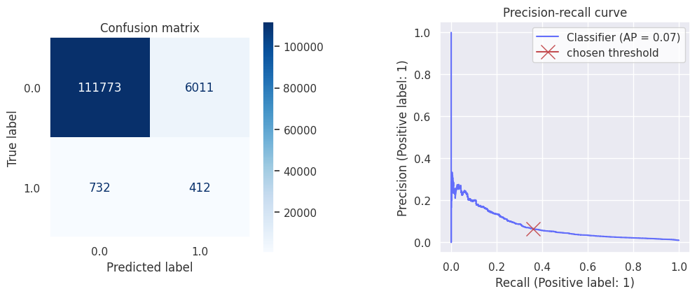

# filler-sound-detector
This project aims at detecting annoying filler sounds in an audio with help of ML.

---

# TL;DR

I could not obtain any practically good results so far. The established baseline is very low (10% F1 score), yet the neural net did not beat even that.

Results:
```markdown
| Model                  | Avg. precision score | F1    |
|------------------------|----------------------|-------|
| LightGBM (baseline)    | 0.103                | 0.114 |
| Multi-layer perceptron | 0.075                | 0.109 |
```

Nevertheless, achieving even some results with PyTorch is huge progress for me, given that I almost never used the library raw. It gives me motivation to improve the model by:
1. Training an RNN and treating the features as sequence.
2. Using augmentation.

---

# Set up
Depedencies are managed with `poetry`. Install it using [instructions here](https://python-poetry.org/docs/#installation).

```bash
$ poetry install
```

---

# Data
I labeled the data myself while editing my friend/client's podcast as a side hustle. There are a total of 67 audio tracks (22.3 GB) and text files with labels. The labels show start and end timestamps of the audio with filler sounds.
- Language: Spanish
- Format: Waveform audio
- Sampling rate: 48k, 16 bit

---

# Processing

## Strategy

While preprocessing, we split the data into equally long frames. Each frame is mapped to not-filler/filler. Possibly, a hopping window can be used.


To decide what frame is a filler, we look at the proportion of its duration that is occupied by filler and if it's above an arbitrary threshold (I picked 80% to begin with), it will be labeled as such.

Window and hopping length can be adjusted after evaluation to find the optimal tradeoff between processing speed and performance.

## Features

The audio frames are transformed into [Mel-frequency cepstral coefficients (MFCCs)](https://en.wikipedia.org/wiki/Mel-frequency_cepstrum). Essentially, MFCC tells us what frequencies were most activated during the speech, creating a kind of compressed spectrogram. It represents the audio clip in a way that is similar to how we humans perceive sound, which makes MFCC a very popular feature in speech recognition systems.


## Labels

To choose an appropriate window and hop length for our data preprocessing, we have to consider the target distribution.

The filler sound length seems to follow a log-normal distribution. 


Turns out in 95% of fillers last longer than 0.279 sec. A good fit for window length, therefore, would be anything below `sample_rate * 0.279`. Given that we down-sample the audio from 48k samples/sec to 8k, we get `2232` samples per window. We'll round that number to `2048`.

---

# Evaluation

To evaluate the models, I use a few principles:
- Use different speakers in training & evaluation. This will ensure the model learns to detect filler sounds well for new speakers.
- Use the same threshold to decide what proportion of filler sound in a frame makes it labeled as `filler` (80%).   
- Use [average precision score (AP)](https://scikit-learn.org/stable/modules/generated/sklearn.metrics.average_precision_score.html) as the main metric (Area under the Precision-Recall Curve). What makes this metric perfect is that it 1) is independent from the cutoff threshold and 2) focuses on the minority class and therefore is suitable for imbalanced datasets. (link)

---

# Modeling

Let's train!

## Baseline

I trained a LightGBM model with reasonable default parameters to establish some baseline.  

```
| Avg. precision score | F1    |
|----------------------|-------|
| 0.103                | 0.114 |
```


## Multi-layer perceptron

I picked multi-layer perceptron as the first neural model to train. It was a good place to start learning how to build the end-to-end workflow of training a model with Pytorch. 

Unfortunately, the model did not beat the baseline but came close in F1 score.

```
| Avg. precision score | F1    |
|----------------------|-------|
| 0.075                | 0.109 |
```



## Improvement ideas

1. **Treat audio frames as sequence:** So far, each audio frame was treated as individual independent training example. However, speech is actually a time series. Order matters. I suspect that treating the audio frames as sequence and using a RNN-like model such as LSTM will improve the results.
2. **Use augmentation:** Although we have 22.3 GB of data, it actually boils down to a few dozens of speakers. Moreover, transforming the audio with MFCC reduces the data to just 5-8 MB per speaker. Augmentation techniques most probably will squeeze more value out of available data.
3. **Play around with parameters:** I can use other parameters in `constants.py` such as the window length & hop length of frames as well as labeling threshold. 

---
