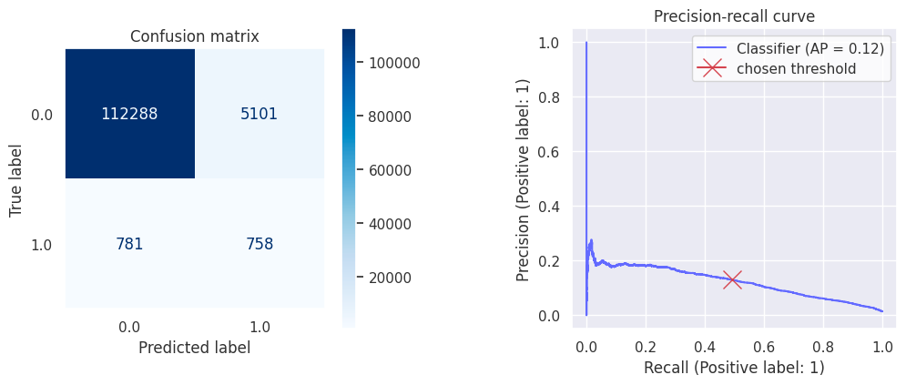

# filler-sound-detector

This project aims at detecting annoying filler sounds in an audio with help of machine learning.

---

# Set up
Depedencies are managed with `poetry`. Install poetry using [instructions](https://python-poetry.org/docs/#installation) and then install dependencies by executing this in the project folder:

```bash
$ poetry install
```

---

# Data
I labeled the data myself while editing my friend/client's podcast as a side hustle. There are a total of 67 audio tracks (22.3 GB) and text files with labels. The labels show start and end timestamps of the audio with filler sounds.
- Language: Spanish
- Format: Waveform audio
- Sampling rate: 48k, 16 bit

---

# Processing

## Strategy

While preprocessing, we split the data into equally long frames. Each frame is mapped to not-filler/filler. Possibly, a hopping window can be used.


To decide what frame is a filler, we look at the proportion of its duration that is occupied by filler and if it's above an arbitrary threshold (I picked 80% to begin with), it will be labeled as such.

Window and hopping length can be adjusted after evaluation to find the optimal tradeoff between processing speed and performance.

## Features

The audio frames are transformed into [Mel-frequency cepstral coefficients (MFCCs)](https://en.wikipedia.org/wiki/Mel-frequency_cepstrum). It tells us what frequencies were most activated during the speech, creating a kind of compressed spectrogram. It represents the audio clip in a way that is similar to how we humans perceive sound, which makes MFCC a very popular feature in speech recognition systems.


## Labels

To choose an appropriate window and hop length for our data preprocessing, we have to consider the target distribution.

The filler sound length seems to follow a log-normal distribution. 


Turns out in 95% of fillers last longer than 0.279 sec. A good fit for window length, therefore, would be anything below `sample_rate * 0.279`. Given that we down-sample the audio from 48k samples/sec to 8k, we get `2232` samples per window. We'll round that number to `2048`.

---

# Evaluation

To evaluate the models, I followed a few principles:
- Use different speakers in training & evaluation. This will ensure the model learns to detect filler sounds well for new speakers.
- Use the same threshold to decide what proportion of filler sound in a frame makes it labeled as `filler` (80%).   
- Use a suitable evaluation metric for imbalanced datasets. [Average precision score](https://scikit-learn.org/stable/modules/generated/sklearn.metrics.average_precision_score.html) (area under the Precision-Recall Curve) seemed to be the best choice. It 1) is independent of the cutoff threshold and 2) focuses on the minority class and therefore is suitable for imbalanced datasets.

---

# Modeling

I tried out training two models: LightGBM & a multi-layer perceptron. LightGBM worked better out of the box.

```markdown
| Model                  | Avg. precision score | F1    |
|------------------------|----------------------|-------|
| LightGBM               | 0.103                | 0.114 |
| Multi-layer perceptron | 0.075                | 0.109 |
```

## LightGBM

Before jumping into deep learning, I trained a LightGBM model with reasonable default parameters to establish some baseline.  

```
| Avg. precision score | F1    |
|----------------------|-------|
| 0.103                | 0.114 |
```


## Multi-layer perceptron

Then I picked multi-layer perceptron as the first neural model to train. After hyperparameter tuning, the model beats the LightGBM on both F1 and AP scores.

```
| Avg. precision score | F1    |
|----------------------|-------|
| 0.122                | 0.213 |
```



## Further improvement ideas

1. **Tune training configuration:** I can use other parameters in `constants.py` such as the window length & hop length of frames as well as labeling threshold.
2. **Treat input data as time series:** So far, each audio frame was treated as individual independent training example. However, it is hard to tell if a small piece of audio is a filler sound without context. Speech is actually a time series where order matters. I suspect that passing a sequence of audio frames instead of just one per training example would improve the results. RNN models such as LSTM can be used.
3. **Sushi method:** Pass raw data with no preprocessing to the neural network.

# Conclusion

Until now, using the model isn't practically useful. Multi-layer perceptron will cut a lot of good sound, whereas LightGBM will leave a lot of filler sounds untouched.

---
